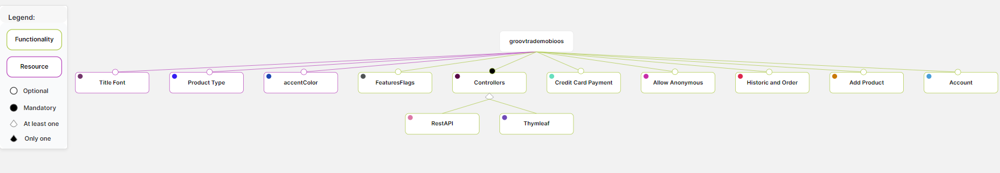

<!-- # Développement d’une application (E-Shop ) Web avec Spring et intégration de Software Product Line -->

## Introduction

Dans le cadre de l'UE DevRep, nous réalisons un projet consistant à développer une application web simplifiée de type E-shop. Cette application devra inclure un catalogue, une fonction de recherche, la création de comptes utilisateurs, l'ajout d'articles au panier, la gestion des commandes et la consultation de l'historique des commandes passées.

Pour cela, nous utiliserons Spring Boot comme framework, une base de données SQL pour stocker les entités, Thymeleaf pour le rendu côté serveur, et VueJS pour le rendu côté client, en association avec notre application RESTful. Cette application servira de modèle pour ce type de projet, en intégrant l'outil Mobioos Forge et l'API Flagsmith pour le déploiement de variantes.

Dans ce document, nous examinerons comment nous avons mis en œuvre cette application. Tout d'abord, nous discuterons de nos idées et de nos choix d'outils pour la conception. Ensuite, nous aborderons la structure de nos entités et de leurs associations dans la base de données, ainsi que l'organisation de notre logique. Nous expliquerons également comment l'utilisateur interagit avec notre application et son API. Enfin, nous évoquerons les outils SPL mis en place pour la variabilité de l'application.

## Structure

> Plongez dans l'univers de GroovTrade pour enrichir vos collections ou partager vos trésors musicaux
                        ! Que vous soyez un mélomane passionné ou une entreprise musicale, découvrez l'opportunité
                        d'acheter et de vendre des vinyles, K7 et CD, neufs ou d'occasions. Des dernières sorties aux pépites indépendantes,
                        vos produits trouveront toujours leur place dans la collection d'un autre passionné.
                        Alors rejoignez-nous pour créer des connexions musicales uniques, élargir vos horizons sonores
                        et faire résonner votre passion au sein de la communauté GroovTrade.

Cette description concerne notre site de E-Shop, où nous avons choisi de créer une plateforme d'achat et de vente de supports musicaux d'occasion.
Dans cette section, nous allons décrire les différentes structures de données de notre site, que ce soit au sein du JPA (Java Persistence API) ou dans la base de données.
Pour maintenir notre base de données, nous avons créé une base de données nommée **groovtrade**. Une copie de cette base de données est disponible dans le dossier _bd_. Vous pouvez l'importer en utilisant la commande `mysql -u username -p database_name < groovtrade.sql` dans votre console.

Pour l'essayer, vous pouvez vous connecter au compte de **myadmin** en utilisant le mot de passe **admin**, ou vous pouvez créer votre propre compte. Veuillez noter que les images doivent avoir une taille inférieure à 300 Ko. Vous trouverez un guide complet dans la section _Guide d'utilisation_ de ce document.

### Entités

Une base de données relationnelle ne peut avoir une structure similaire à celle des classes JAVA. En effet, une base de données utilise des tables d'associations, tandis que les classes peuvent être encapsulées. Par conséquent, la base de données est plus rigide que les classes. Dans notre système, multiplier les associations entre objets équivaut à multiplier les tables, ce qui entraîne une augmentation de la complexité.

Pour pallier à ce problème, nous avons distingué les objets embarquables des objets entités.


> Le diagramme UML des relations entre les classes de l'application, les méthodes sont omises

* La classe "Utilisateur" représente les utilisateurs ayant un compte sur le site. Ils possèdent une liste d'historiques de commandes, et l'utilisateur a un panier. Cette classe est représentée comme une entité dans la base de données.

* Un "Historique" représente une commande passée, pouvant être en cours, payée ou annulée. L'historique possède une liste de "PanierItem" et une référence à un utilisateur. Cette classe est également représentée comme une entité dans la base de données.

* La classe "Produit" représente les produits mis en ligne par les utilisateurs. Un produit possède une liste de "ProduitImg", un "ProduitType", ainsi qu'un "ProduitMeta". Cette classe est également représentée comme une entité dans la base de données.

Nous rencontrons un problème lors de la lecture de la base de données lors de la sérialisation. En effet, l'objet "Utilisateur" fait référence à des "Historiques", tandis qu'un "Historique" fait référence à un "Utilisateur". Pour résoudre ce problème, nous pouvons ajouter les annotations `@JsonBackReference` et `@JsonManagedReference`.

Les objets marqués comme `@Embeddable` sont des objets qui n'ont pas besoin de table dans la base de données, car tous leurs attributs sont maintenus dans la table d'association des entités qui les encapsulent. Ces classes incluent :

* "Panier", qui représente le panier d'un utilisateur. Il ne peut pas exister sans utilisateur, mais identifier un panier par un ID n'aurait pas de sens, car il est lié à l'utilisateur.

* "PanierItem" est une sorte d'abstraction dans l'application. En effet, il faut un moyen de maintenir le nombre d'articles par produit dans le panier de l'utilisateur et dans les historiques de l'utilisateur. Il fait donc référence à un produit. De la même manière que pour le panier, attribuer un ID à chaque article dans les différents historiques et paniers des utilisateurs compliquerait la base de données.

* "ProduitMeta", "ProduitType" et "ProduitImg" représentent toutes les données périphériques d'un produit. Ces informations sont uniques pour chaque produit.

Pour encapsuler une classe embarquable, on annote l'attribut avec `@Embedded`. S'il y a une association multiple, on l'annote avec `@ElementCollection` et on renseigne le nom de la table d'association ainsi que la clé étrangère par laquelle on peut l'identifier.

### Base de Donnée


> Tables de la base de donnée groovtrade

On voit ici, par exemple, que compte tenu de la relation entre "Produit" et "ProduitImg", "ProduitMeta" et "ProduitType", ces derniers sont encapsulés dans la table "Produit". En revanche, il y a deux tables distinctes pour représenter les listes d'articles dans le panier (associées à l'ID de l'utilisateur, car c'est une entité permettant d'identifier les paniers) et les listes d'articles dans les historiques.

## Logiques

Pour avoir un aperçu de l'organisation des logiques, voici l'organisation des packages et dossier de l'application.

```txt
.
├── Dockerfile
├── HELP.md
├── README.md
├── bd
│   └── groovtrade.sql
├── docker-compose.yml
├── groovtrade-front
│   ├── node_modules
│   │ 
│   ├── package-lock.json
│   ├── package.json
│   ├── server.js
│   └── src
│       ├── detailsProduit.html
│       ├── index.html
│       ├── login.html
│       └── produit.html
├── mvnw
├── mvnw.cmd
├── pom.xml
└── src
    ├── main
    │   ├── java
    │   │   └── fr
    │   │       └── haron
    │   │           └── groovtrade
    │   │               ├── GroovtradeApplication.java
    │   │               ├── configs
    │   │               │   └── CustomWebConfig.java
    │   │               ├── controllers
    │   │               │   ├── APIRestController.java
    │   │               │   ├── APIRestControllerAdvice.java
    │   │               │   ├── GlobalControllerAdvice.java
    │   │               │   ├── LoginController.java
    │   │               │   ├── ProduitController.java
    │   │               │   ├── SignupController.java
    │   │               │   └── UtilisateurController.java
    │   │               ├── dao
    │   │               │   ├── HistoriqueRepository.java
    │   │               │   ├── ProduitRepository.java
    │   │               │   └── UtilisateurRepository.java
    │   │               ├── dto
    │   │               │   ├── DTOInterface.java
    │   │               │   ├── ErrorDTO.java
    │   │               │   ├── GlobalDTO.java
    │   │               │   ├── JwtDTO.java
    │   │               │   ├── LoginDTO.java
    │   │               │   ├── MessageDTO.java
    │   │               │   ├── RedirectDTO.java
    │   │               │   ├── produit
    │   │               │   │   ├── AjouterProduitDTO.java
    │   │               │   │   ├── ModifierProduitDTO.java
    │   │               │   │   ├── ProduitDetailsDTO.java
    │   │               │   │   └── ProduitListeDTO.java
    │   │               │   └── utilisateur
    │   │               │       ├── AjouterPanierDTO.java
    │   │               │       ├── CheckoutDTO.java
    │   │               │       ├── HistoriqueAchatsDTO.java
    │   │               │       ├── ModifierPanierDTO.java
    │   │               │       ├── ProfileDTO.java
    │   │               │       └── UtilisateurDTO.java
    │   │               ├── entities
    │   │               │   ├── Historique.java
    │   │               │   ├── Panier.java
    │   │               │   ├── PanierItem.java
    │   │               │   ├── Produit.java
    │   │               │   ├── ProduitImg.java
    │   │               │   ├── ProduitMeta.java
    │   │               │   ├── ProduitSong.java
    │   │               │   ├── ProduitType.java
    │   │               │   └── Utilisateur.java
    │   │               └── security
    │   │                   ├── CustomUserDetailsService.java
    │   │                   ├── JwtAuthFilter.java
    │   │                   ├── JwtService.java
    │   │                   ├── RefererValidator.java
    │   │                   └── SecurityConfig.java
    │   └── resources
    │       ├── application-docker.properties
    │       ├── application.properties
    │       ├── static
    │       │   ├── css
    │       │   │   └── produits_style.css
    │       │   ├── font
    │       │   │   ├── Crimen en Levante.ttf
    │       │   │   ├── Musicografi.ttf
    │       │   │   ├── aAbstractGroovy.otf
    │       │   │   └── aAbstractGroovy.ttf
    │       │   ├── images
    │       │   │   
    │       │   └── js
    │       │       ├── API_scripts.js
    │       │       └── produits_script.js
    │       └── templates
    │           ├── ajouterProduit.html
    │           ├── checkout.html
    │           ├── detailsProduit.html
    │           ├── footer.html
    │           ├── guide.html
    │           ├── header.html
    │           ├── historique.html
    │           ├── index.html
    │           ├── modifierProduit.html
    │           ├── msg.html
    │           ├── produits.html
    │           ├── profile.html
    │           ├── signup.html
    │           └── utilisateur.html
    └── test
        └── java
            └── fr
                └── haron
                    └── groovtrade
                        └── GroovtradeApplicationTests.java
```

> l'arbre de la hiérachie de notre application

### Controllers

Les **contrôleurs** permettent de mapper les redirections de l'application, créant ainsi un arbre de liens pour l'utilisateur :

Dans cette section, nous nous intéresserons au mappage des requêtes du côté serveur de l'application (nous reviendrons plus tard sur la vue générée du côté serveur et du côté client).

Les contrôleurs (hors RESTful) interagissent avec la vue via des objets `Model`, qui encapsulent des attributs auxquels la vue peut accéder. Les contrôleurs capturent les requêtes HTTP POST ou GET pour effectuer des opérations logiques. L'utilisateur peut ainsi interagir avec ces logiques, qui constituent le fonctionnement de notre application :

* `GlobalAdviceController` : Ce contrôleur permet de fournir un modèle (`Model`) à la vue quelle que soit la vue à générer et de capturer les requêtes quelle que soit leur provenance. Il est notamment utilisé pour la gestion des erreurs et pour transmettre certaines informations telles que le nom de l'utilisateur ou son image de profil.

* `LoginController` : Gère les opérations logiques à partir de la racine de l'application (`/`), notamment les actions à effectuer après une connexion réussie.

* `SignupController` : Gère le mappage pour l'inscription d'un nouvel utilisateur. Il renvoie notamment le formulaire permettant à l'utilisateur de s'inscrire et capture les requêtes HTTP destinées à l'inscription.

* `ProduitController` : L'un des deux contrôleurs qui gèrent les opérations logiques cruciales de l'application. Celui-ci est le point d'entrée de la page _/produits/liste_, qui représente le catalogue des produits et toutes les opérations pour l'afficher et le gérer :

  * _/produits/liste Get_ : affiche le catalogue.
  * _/produits/ajouterProduit Get_ : renvoie la vue du formulaire d'ajout de produit.
  * _/produits/ajouter Post_ : ajoute un produit au catalogue.
  * _/produits/delete Get_ : supprime un produit du catalogue (peu utilisé car les produits sont généralement archivés plutôt que supprimés).
  * _/produits/details/{id} Get_ : accède aux détails d'un produit par son identifiant.
  * _/produits/modifierProduit Get_ : renvoie la vue du formulaire de modification d'un produit.
  * _/produit/modifier Post_ : modifie les informations d'un produit.
* `UtilisateurController` : Permet de mapper toutes les opérations liées à l'utilisateur, notamment l'ajout au panier, le processus de paiement, l'historique des commandes et sa liste de vente.

### Repositorys

Les **Repository** JPA sont des interfaces qui simplifient l'interaction avec la base de données, ils représentent la base de donnée persistante en mémoire interne. Ils déclarent des méthodes pour effectuer des opérations de lecture, d'écriture, de mise à jour et de suppression sur des entités Java, et Spring Data JPA génère automatiquement les requêtes SQL correspondantes. Ces composants jouent un rôle essentiel en offrant une abstraction de haut niveau pour la persistance des données, facilitant ainsi le développement d'applications robustes et maintenables. Nous utilisons des repositories par entités.

### Sécurités

L'application est dotée d'une sécurité simple pour authentifier les utilisateurs et protéger les données sensibles. Dans la partie sécurité, il existe la gestion des filtres de sécurité qui permettent de contrôler l'accès aux ressources et aux fonctionnalités de l'application en fonction des rôles des utilisateurs. De plus, la gestion des rôles utilisateurs assure que seules les personnes autorisées peuvent effectuer certaines actions. En ce qui concerne la sécurité web, l'application prend en compte les aspects tels que CORS (Cross-Origin Resource Sharing) pour contrôler les requêtes provenant de domaines différents, la prévention CSRF (Cross-Site Request Forgery) pour éviter les attaques de falsification de requêtes entre sites, et l'utilisation de jetons JWT (JSON Web Tokens) pour l'authentification depuis l'API, offrant ainsi un niveau de sécurité supplémentaire en vérifiant l'identité des utilisateurs et en garantissant un accès sécurisé aux données et aux fonctionnalités de l'application.

### API REST

L'API REST permet de fournir une interface aux utilisateurs pour utiliser les fonctionnalités de notre application. Par exemple, ils peuvent créer leur propre vue pour notre application.

Cette API repose sur un système de Data Transfer Object (DTO) pour gérer la sérialisation des données. Chaque DTO implémente l'interface `DTOInterface`. Il existe un `GlobalDTO` car avec l'API REST, nous ne pouvons pas transmettre un modèle (`Model`) à la vue, mais seulement des données sérialisées. Le `GlobalDTO` est renvoyé dans chaque requête HTTP depuis le serveur et encapsule les DTO spécifiques à chaque mapping. Il existe des DTO spécifiques tels que `MessageDTO`, `ErrorDTO`,`JwtDTO` , et `RedirectDTO` pour suggérer à l'utilisateur de l'API d'activer des mécanismes spéciaux.

Le contrôleur `APIRestController` reproduit toutes les logiques précédemment vues et les expose via l'URL _/api/..._.

Cette API peut être utilisée conjointement avec ReactJS, par exemple, ou tout autre framework de rendu côté client.

## Vues

Il y a deux paradigmes dans les applications web : le serveur génère la vue, ou le client génère la vue. Dans tous les cas, la réutilisabilité est un principe clé.

### Thymeleaf

Thymeleaf est utilisé pour générer des vues côté serveur, intégré dans le code HTML. Le site généré côté serveur est entièrement fonctionnel, et vous pouvez accéder au catalogue en utilisant le chemin `/produits/liste`. Pour promouvoir la réutilisabilité, nous partageons, par exemple, la vue utilisateur avec les mappings tels que `/utilisateur/{username}/ventes`, `/utilisateur/{username}/panier`, et `/utilisateur/{username}/historique/{id}/details`, permettant ainsi l'affichage d'une liste de PanierItems.

#### Guide d'utilisation

Démarré le Server pour rendre disponible la vue Thymleaf générer par le serveur, allé à l'adresse _/welcome_ pour afficher le guide d'utilisation du site.

Voici quelques capture d'écran


### Framework

À l'instar de PHP, Python, et Java Spring, il est possible de créer des serveurs avec JavaScript. L'intérêt réside dans l'utilisation de frameworks, c'est-à-dire des outils de développement web qui interagissent avec le client et exécutent le code de rendu côté client (à différencier de Thymeleaf qui effectue le rendu côté serveur avant de l'envoyer au client). Ces frameworks existent sous forme de nombreux modules en JavaScript. Les frameworks les plus connus incluent ReactJS par Facebook, AngularJS par Google, et Vue.js, qui est open source. Il existe de nombreux autres frameworks, mais nous avons choisi d'utiliser Vue.js en raison de sa légèreté en termes de dépendances, de code, et de sa syntaxe qui peut se rapprocher de Thymeleaf.

L'API REST peut être utilisée conjointement avec ReactJS, par exemple, pour générer du code HTML dans lequel nos objets sont sérialisés et intégrés dans le DOM.

Une ébauche d'application Vue.js se trouve dans le dossier _/groovtrade-frontend_, exploitant notre API complètement opérationnelle. Vous pouvez démarrer cette application avec Node en exécutant la commande `node server`.

#### Docker

Docker est un outil essentiel pour assurer la portabilité et la cohérence des applications en les emballant dans des conteneurs isolés. Dans notre cas, Docker s'avère utile pour maintenir une uniformité de l'environnement d'exécution de notre application Spring Boot, indépendamment de la machine hôte.

Nous commençons par créer un Dockerfile pour emballer notre application JAR dans un conteneur Docker. Ensuite, avec `docker build -t groovtrade`, nous construisons l'image Docker de notre application. L'utilisation de Docker Compose, définie dans docker-compose.yml, nous permet de configurer facilement notre application et notre base de données MySQL. Pour s'adapter spécifiquement à l'environnement Docker, nous utilisons _application-docker.properties_ dans notre application Spring Boot. Un point crucial est l'ajout d'un health check dans le service MySQL, garantissant ainsi que notre application ne démarre que lorsque MySQL est pleinement opérationnel. On démarre notre application avec la commande `docker-compose up`.

Cette approche offre de grandes possibilités pour l'avenir, notamment en facilitant le développement distribué grâce à des environnements partagés et cohérents. De plus, elle nous permet d'intégrer d'autres services, comme un serveur utilisant une API REST, simplement en ajoutant de nouveaux services à notre configuration Docker Compose. L'utilisation de Docker ouvre ainsi la voie à une flexibilité accrue dans le déploiement et le développement de notre application.

## Variabilité (SPL)

La variabilité logicielle, souvent abrégée SPL (Software Product Line), se réfère à la capacité d'un logiciel ou d'une application à être configuré et adapté pour répondre à différentes exigences ou scénarios d'utilisation. Plutôt que de créer des versions distinctes pour chaque variation, une SPL utilise des composants et des fonctionnalités modulaires qui peuvent être activés ou désactivés en fonction des besoins. Cela permet d'économiser du temps et des ressources en évitant de développer des produits complètement séparés pour chaque cas d'utilisation, tout en offrant une flexibilité pour personnaliser le logiciel en fonction des besoins spécifiques de chaque client ou utilisateur.

### Features Mapping avec  Mobioos Forge

Mobioos Forge est une extension pour l'IDE Visual Studio Code qui facilite la définition de la manière dont une application évolue et comment cela se reflète dans le code source de l'application. Elle est particulièrement utile pour moderniser les applications monolithiques et créer des versions alternatives.

Mobioos Forge utilise le concept de "mapping" (cartographie) et de "mark" (annotation) pour créer une carte des fonctionnalités d'une application. Le mapping établit une relation entre une fonctionnalité spécifique et le code source qui la met en œuvre, tandis que le mark consiste en une annotation dans le code, indiquant qu'une partie du code est liée à une autre.

La carte des fonctionnalités permet de mieux comprendre l'architecture de l'application, d'identifier les dépendances entre les différentes fonctionnalités, et simplifie la maintenance de l'application.

#### Features Identifiés

Il existe deux types de fonctionnalités : les fonctionnalités liées aux ressources, telles que des fichiers, des couleurs ou des textes, qui sont décidées lors de la création de la variante, et les fonctionnalités liées au comportement de l'application, qui peuvent s'étendre sur l'ensemble d'un fichier ou être mappées/annotées sur des lignes de code dans différents langages. Si une fonctionnalité n'est pas sélectionnée, elle suit le comportement par défaut, qui peut être la suppression du code mappé. Cependant, on peut également définir un comportement alternatif avec un code de remplacement.



> Diagramme de notre features model

Pour les features liées aux ressources :

* **Title Font** : Modifie la police d'écriture du titre de l'application dans l'en-tête, ce qui affecte la feuille de style _produits\_style.css_.
* **Product Type** : Restreint l'application à un seul type de produit parmi CD, K7, VINYLE33 et VINYLE45, ce qui modifie la requête JPA dans _ProduitRepository.java_.
* **Accent Color** : Change la couleur d'accentuation de Groovtrade et modifie également _produits\_style.css_.

Pour les features liées aux fonctionnalitées :

* **Features Flags** active les features flags de l'API Flagsmith dans *produits_script.js*
* **Controller**Permet de choisir au moins un contrôleur pour l'application, tel que API REST et Thymeleaf, qui offre une interface frontend côté serveur.
* **Credit Payment** Remplace le code de la vue de paiement PayPal par un formulaire de carte de crédit. Si cette fonctionnalité est activée, **Historic and Order** est également activé.
* **Allow Anonymous** Si activé, les utilisateurs non authentifiés peuvent naviguer sur le site, ce qui modifie une partie de la configuration de sécurité.
* **Historic and Order** Cette fonctionnalité permet aux utilisateurs connectés de passer des commandes et de consulter leur historique de commandes. Elle est active si **Account** est également activé et modifie certaines parties du contrôleur utilisateur, ainsi que certains mappings de l'API REST. Si Thymeleaf est sélectionné, il modifie également l'interface frontend.
* **Add Product** Permet à un utilisateur connecté d'ajouter un produit au catalogue, ce qui modifie le contrôleur de produit, le contrôleur utilisateur pour l'accès aux ventes, ainsi que certains mappings de l'API. Elle est disponible si **Account** est également activé.
* **Account** Englobe toutes les fonctionnalités liées aux comptes, telles que la création et l'accès aux comptes, la connexion via l'API REST, et la gestion des ventes et des achats.

Ces fonctionnalités permettent de personnaliser notre application en fonction des besoins spécifiques de chaque projet ou utilisation.

### Features FLags avec Flagsmith

Flagsmith est une API de configuration à distance qui permet aux développeurs de contrôler dynamiquement le comportement de leurs applications en fonction de différents critères. Elle est utilisée pour déployer des fonctionnalités par tranches, tester des nouvelles fonctionnalités, personnaliser l'expérience utilisateur et gérer les déploiements globaux.
Les drapeaux sont des variables booléennes qui permettent de contrôler l'accès à différentes fonctionnalités ou comportements de l'application. Flagsmith permet de créer, modifier et supprimer des drapeaux facilement.
L'outil peut facilement être intégré à notre projet car l'API offre des intégrations natives avec de nombreux frameworks et bibliothèques, tels que JavaScript, Java, iOS et Android. Nous avons choisi d'utiliser Flagsmith sur notre frontend pour une intégration simple et rapide en JavaScript de features n'ayant pas besoin des ressources du serveur.

Le code ce trouve dans _js/produits_style.js_.


> FLags identifiées pour l'application WEB Groovtrade

* **dark_theme** est une feature qui active le thème sombre sur toutes les pages du site WEB
* **discog_completion**  est une fonctionnalité qui ajoute l'intégration de l'API Rest de Discogs, une base de données et une marketplace dédiée à la musique. Un bouton est ajouté à la vue d'ajout ou de modification d'un produit, permettant de compléter automatiquement les informations d'un son, et ouvre une fenêtre popup de la page Discogs associée au produit en question. Étant donné que c'est une fonctionnalité expérimentale, elle a sa place en tant que features flags.


## Conclusion

Ce projet nous offre un aperçu complet de toutes les fonctionnalités nécessaires pour créer une application web de base. Il comprend un rendu côté serveur qui génère les pages web, une API qui permet une interaction côté client, une base de données persistante pour stocker les données à travers les actions de l'utilisateur, ainsi que des configurations de sécurité essentielles pour garantir la confidentialité et l'intégrité des informations. De plus, notre application est conçue pour être flexible grâce à l'intégration d'outils de Gestion de Ligne de Produits (SPL).

À l'avenir, nous avons l'intention d'intégrer davantage de fonctionnalités pour améliorer l'expérience de l'utilisateur. Parmi celles-ci, nous envisageons d'ajouter une liste de souhaits pour permettre aux utilisateurs de sauvegarder leurs articles préférés, ainsi qu'une liste de genres musicaux favoris pour une navigation plus personnalisée. Nous cherchons également à personnaliser davantage l'expérience de l'utilisateur afin de garantir que l'abonné puisse bénéficier d'une expérience sur mesure et fidèle à ses préférences. En outre, nous avons pour projet de mettre en place un système de radio, offrant aux utilisateurs la possibilité de découvrir des musiques de niche et d'explorer de nouvelles pistes musicales passionnantes.
